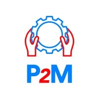

# AUDIT PRO COMPLET — WWW.IMMEIT.COM — VERSION 2
## Prompt d'injection pour éditeur IA (VSCode / OpenCode / Claude Code)
> Objectif : Site opérationnel à 100% sur tout terminal, écran, navigateur
> Date d'audit : Juin 2026 | Après modifications v2

---

## SECTION 0 — DELTA DEPUIS L'AUDIT PRÉCÉDENT

### ✅ Corrections appliquées (confirmées sur le live)
| Problème | Statut |
|---|---|
| Noms de fichiers avec espaces (`logo P2M.jpeg`) | ✅ Corrigé → `logo-P2M.jpeg` |
| Alt texts partenaires | ✅ Corrigé → `Logo P2M - Partenaire` |
| Section `#why` sans descriptions | ✅ Corrigé — 6 items avec body texte |
| Footer nav incomplet | ✅ Corrigé — tous les liens présents |

### ❌ Problèmes encore présents (non corrigés)
| Problème | Gravité |
|---|---|
| Meta `csrf-token` vide et inutile | 🟠 |
| Hero image sans alt text | 🟠 |
| Compteurs animés sans valeur de fallback (affichent "0") | 🔴 |
| KPI counters sans valeur de fallback (affichent "0%") | 🔴 |
| OG tags / Twitter Card absents sur les 2 subpages | 🟠 |
| `<link rel="canonical">` absent sur les 2 subpages | 🟠 |
| Navigation subpages = `index.html#section` (mauvaise forme) | 🟡 |
| `climatisation.html` sans footer complet | 🔴 |
| `methodes-maintenance.html` sans footer complet | 🔴 |
| `robots.txt` absent | 🟠 |
| `sitemap.xml` absent | 🟠 |
| `mentions-legales.html` absente | 🔴 |
| `politique-confidentialite.html` absente | 🟠 |
| Page `404.html` absente | 🟡 |
| Favicon non déclaré en `<link>` | 🟡 |
| Pas de `loading="lazy"` sur les images | 🟡 |
| Pas de balise `<meta name="language">` | 🟡 |

---

## SECTION 1 — ARCHITECTURE COMPLÈTE DU SITE

### Structure de fichiers actuelle (confirmée)
```
immeit.com/
├── index.html                    ← Page principale (one-page)
├── methodes-maintenance.html     ← Page service #1
├── climatisation.html            ← Page service #2
├── logo-immeit.jpeg              ← Logo principal
├── logo-P2M.jpeg                 ← Logo partenaire (corrigé)
├── logo-INDUSTRELEC.jpeg         ← Logo partenaire (corrigé)
├── indicateur-de-production.jpg  ← Image hero
├── [style.css ou équivalent]     ← CSS (non accessible directement)
└── [script.js ou équivalent]     ← JS (non accessible directement)

MANQUANT :
├── robots.txt                    ← À CRÉER
├── sitemap.xml                   ← À CRÉER
├── 404.html                      ← À CRÉER
├── mentions-legales.html         ← À CRÉER
└── politique-confidentialite.html ← À CRÉER
```

---

## SECTION 2 — ÉTAT DÉTAILLÉ DE CHAQUE PAGE

---

### 2.1 — `index.html` (Page principale)

#### HEAD — État actuel
```html
<!-- ✅ PRÉSENT ET CORRECT -->
<meta charset="UTF-8">
<meta name="viewport" content="width=device-width, initial-scale=1.0">
<meta name="description" content="IMMEIT — Installation, Méthodes et Maintenance...">
<meta name="theme-color" content="#111927">
<meta name="referrer" content="strict-origin-when-cross-origin">
<meta property="og:title" content="...">
<meta property="og:description" content="...">
<meta property="og:image" content="https://www.immeit.com/logo-immeit.jpeg">
<meta property="og:url" content="https://www.immeit.com">
<meta property="og:type" content="website">
<meta name="twitter:card" content="summary_large_image">
<meta name="twitter:title" content="...">
<meta name="twitter:description" content="...">
<link rel="canonical" href="https://www.immeit.com">
<title>IMMEIT — Installation, Méthodes et Maintenance des Equipements Industriels et Tertiaires</title>

<!-- ❌ À SUPPRIMER -->
<meta name="csrf-token" content="">   ← Inutile, résidu à enlever

<!-- ❌ MANQUANT -->
<link rel="icon" href="/logo-immeit.jpeg" type="image/jpeg">
<meta name="language" content="fr">
<meta name="author" content="IMMEIT">
<meta name="geo.region" content="SN">
<meta name="geo.placename" content="Dakar">
```

#### Navigation principale — ✅ Correct
```
Logo → /   |  À propos → #about  |  Services → #services
Méthodologie → #methodo  |  Piliers → #piliers
Engagements → #engagement  |  Pourquoi choisir IMMEIT ? → #why
Contact → #contact
```

#### Section HERO (`#hero`) — Problèmes identifiés
```html
<!-- ❌ PROBLÈME 1 : Image hero sans alt -->

<!-- CORRECTION : -->


<!-- ❌ PROBLÈME 2 : Compteurs à "0" sans data-target -->
<span class="counter">0</span> Clients accompagnés
<span class="counter">0</span> Collaborateurs
<span class="counter">0</span> Domaines d'expertise
<!-- CORRECTION : Ajouter data-target avec les vraies valeurs -->
<span class="counter" data-target="[VALEUR]">0</span> Clients accompagnés
<!-- Si les valeurs ne sont pas encore publiques, afficher une valeur statique -->
```

#### Section KPI — Problèmes identifiés
```html
<!-- ❌ PROBLÈME : 4 compteurs % affichent "0%" sans JS -->
<span class="kpi-value">0</span>%
<!-- CORRECTION : -->
<span class="kpi-value" data-target="[VALEUR]">0</span>%
```

#### Footer — ✅ Corrigé et complet
```
Liens : À propos | Services | Méthodologie | Piliers | Engagements
        Pourquoi choisir IMMEIT ? | Contact
Réseaux : LinkedIn | WhatsApp
© 2026 IMMEIT
```

---

### 2.2 — `methodes-maintenance.html`

#### HEAD — État actuel avec corrections requises
```html
<!-- ✅ PRÉSENT -->
<meta name="viewport" content="width=device-width, initial-scale=1.0">
<meta name="description" content="IMMEIT - Méthodes Maintenance & Performance industrielle">
<title>Méthodes Maintenance & Performance - IMMEIT</title>

<!-- ❌ TOUT CE QUI SUIT EST MANQUANT — À AJOUTER OBLIGATOIREMENT -->
<meta charset="UTF-8">
<link rel="canonical" href="https://www.immeit.com/methodes-maintenance.html">
<link rel="icon" href="/logo-immeit.jpeg" type="image/jpeg">
<meta name="theme-color" content="#111927">
<meta name="language" content="fr">
<meta name="author" content="IMMEIT">

<!-- Open Graph MANQUANT -->
<meta property="og:title" content="Méthodes Maintenance & Performance Industrielle — IMMEIT">
<meta property="og:description" content="IMMEIT accompagne les entreprises industrielles et tertiaires dans la mise en place de méthodes de maintenance structurées : audit, GMAO, KPI, fiabilisation.">
<meta property="og:image" content="https://www.immeit.com/logo-immeit.jpeg">
<meta property="og:url" content="https://www.immeit.com/methodes-maintenance.html">
<meta property="og:type" content="website">

<!-- Twitter Card MANQUANT -->
<meta name="twitter:card" content="summary_large_image">
<meta name="twitter:title" content="Méthodes Maintenance & Performance Industrielle — IMMEIT">
<meta name="twitter:description" content="IMMEIT accompagne les entreprises industrielles et tertiaires dans la mise en place de méthodes de maintenance structurées.">
```

#### Navigation — Problème de format
```html
<!-- ❌ ACTUEL : utilise index.html# (déprécié si canonical est /) -->
<a href="https://www.immeit.com/index.html#hero">Accueil</a>
<a href="https://www.immeit.com/index.html#about">À propos</a>

<!-- ✅ CORRECTION : utiliser le chemin propre -->
<a href="https://www.immeit.com/#hero">Accueil</a>
<a href="https://www.immeit.com/#about">À propos</a>
<!-- OU en relatif si même domaine : -->
<a href="/#about">À propos</a>
```

#### Footer — ❌ ABSENT ou incomplet
Le footer complet est ABSENT sur cette page. Il doit être identique au footer de `index.html`.

**Footer à ajouter :**
```html
<footer>
  <div class="footer-content">
    <a href="/" class="footer-logo">
      
      <span>IMMEIT</span>
    </a>
    <nav class="footer-nav">
      <a href="/#about">À propos</a>
      <a href="/#services">Services</a>
      <a href="/#methodo">Méthodologie</a>
      <a href="/#piliers">Piliers</a>
      <a href="/#engagement">Engagements</a>
      <a href="/#why">Pourquoi choisir IMMEIT ?</a>
      <a href="/#contact">Contact</a>
    </nav>
    <div class="footer-social">
      <a href="https://www.linkedin.com/company/immeit-installation-m%C3%A9thodes-maintenance-des-%C3%A9quipements-industriels-et-tertiaires/"
         target="_blank" rel="noopener noreferrer" aria-label="LinkedIn IMMEIT">LinkedIn</a>
      <a href="https://wa.me/221710338809"
         target="_blank" rel="noopener noreferrer" aria-label="WhatsApp IMMEIT">WhatsApp</a>
    </div>
    <p class="footer-copy">© 2026 IMMEIT</p>
  </div>
</footer>
```

---

### 2.3 — `climatisation.html`

#### HEAD — État actuel avec corrections requises
Même problèmes que `methodes-maintenance.html` :
```html
<!-- ❌ MANQUANT — OG, Twitter Card, canonical, charset, favicon -->
<!-- Ajouter en HEAD : -->
<meta charset="UTF-8">
<link rel="canonical" href="https://www.immeit.com/climatisation.html">
<link rel="icon" href="/logo-immeit.jpeg" type="image/jpeg">
<meta name="theme-color" content="#111927">
<meta property="og:title" content="Climatisation Industrielle, Tertiaire & Résidentielle — IMMEIT">
<meta property="og:description" content="IMMEIT propose la vente, installation et maintenance de systèmes de climatisation pour les secteurs industriel, tertiaire et résidentiel. Dakar et Paris.">
<meta property="og:image" content="https://www.immeit.com/logo-immeit.jpeg">
<meta property="og:url" content="https://www.immeit.com/climatisation.html">
<meta property="og:type" content="website">
<meta name="twitter:card" content="summary_large_image">
<meta name="twitter:title" content="Climatisation Industrielle, Tertiaire & Résidentielle — IMMEIT">
<meta name="twitter:description" content="Vente, installation et maintenance de systèmes de climatisation. Intervention sous 24h. Basé à Dakar et Paris.">
```

#### Contenu — Éléments manquants critiques
```
❌ Pas de CTA vers la page de contact
❌ Pas de footer
❌ Pas de lien de retour vers l'accueil (sauf dans la nav)
❌ Aucun numéro de téléphone ni email affiché
```

**CTA à ajouter avant le footer :**
```html
<section class="cta-section">
  <div class="container">
    <h2>Besoin d'une installation ou d'une maintenance de climatisation ?</h2>
    <p>Notre équipe intervient sous 24h. Contactez-nous pour un devis gratuit.</p>
    <a href="/#contact" class="btn btn-primary">Demander un devis</a>
    <div class="contact-direct">
      <a href="tel:+221710338809">+221 71 033 88 09</a>
      <a href="tel:+33754011945">+33 7 54 01 19 45</a>
    </div>
  </div>
</section>
```

---

## SECTION 3 — AUDIT RESPONSIVE DESIGN (PRIORITÉ MAXIMALE)

### 3.1 — Breakpoints à couvrir obligatoirement

| Nom | Taille | Appareils cibles |
|---|---|---|
| xs (mobile S) | 320px – 374px | iPhone SE, anciens Android |
| sm (mobile M) | 375px – 413px | iPhone 12/13/14 standard |
| md (mobile L) | 414px – 479px | iPhone Plus, grands Android |
| lg (tablette portrait) | 480px – 767px | iPad mini portrait, tablettes |
| xl (tablette paysage) | 768px – 1023px | iPad Air/Pro portrait, petits PC |
| 2xl (desktop S) | 1024px – 1279px | PC écrans 13-14" |
| 3xl (desktop M) | 1280px – 1535px | PC écrans 15-17" |
| 4xl (desktop L) | 1536px+ | Grands écrans, 4K |

### 3.2 — Règles CSS responsives manquantes ou à vérifier

#### ❌ PROBLÈME UNIVERSEL : images non contraintes
Toutes les images doivent avoir :
```css
img {
  max-width: 100%;
  height: auto;
  display: block;
}
```

#### ❌ PROBLÈME : Navigation mobile
Le menu hamburger doit être visible sur mobile et bien fonctionner :
```css
/* Mobile : masquer nav, afficher burger */
@media (max-width: 767px) {
  .nav-links {
    display: none;
    flex-direction: column;
    position: fixed;
    top: 0;
    left: 0;
    width: 100%;
    height: 100vh;
    background: #111927;
    z-index: 1000;
    padding-top: 80px;
    align-items: center;
    justify-content: center;
    gap: 2rem;
  }
  .nav-links.open {
    display: flex;
  }
  .nav-burger {
    display: flex;
    z-index: 1001;
  }
  /* Empêcher le scroll quand menu ouvert */
  body.menu-open {
    overflow: hidden;
  }
}
/* Desktop : afficher nav normale */
@media (min-width: 768px) {
  .nav-burger { display: none; }
  .nav-links { display: flex; flex-direction: row; }
}
```

#### ❌ PROBLÈME : Section hero sur mobile
```css
/* Hero */
.hero {
  min-height: 100svh; /* svh = small viewport height (gère iOS Safari) */
  padding: 80px 1rem 2rem; /* padding-top pour la navbar fixe */
  text-align: center;
}
@media (max-width: 767px) {
  .hero h1 { font-size: clamp(1.6rem, 5vw, 2.5rem); }
  .hero p  { font-size: clamp(0.9rem, 3vw, 1.1rem); }
  .hero-buttons { flex-direction: column; align-items: center; gap: 1rem; }
  .hero-buttons a { width: 100%; max-width: 280px; text-align: center; }
  .hero-stats {
    flex-direction: column;
    gap: 1.5rem;
  }
}
```

#### ❌ PROBLÈME : Grille de services sur mobile
```css
.services-grid {
  display: grid;
  grid-template-columns: repeat(auto-fit, minmax(280px, 1fr));
  gap: 1.5rem;
}
@media (max-width: 479px) {
  .services-grid { grid-template-columns: 1fr; }
}
```

#### ❌ PROBLÈME : Section KPI sur mobile
```css
.kpi-grid {
  display: grid;
  grid-template-columns: repeat(4, 1fr);
  gap: 1.5rem;
}
@media (max-width: 767px) {
  .kpi-grid { grid-template-columns: repeat(2, 1fr); }
}
@media (max-width: 479px) {
  .kpi-grid { grid-template-columns: 1fr; }
}
```

#### ❌ PROBLÈME : Section méthodologie (étapes) sur mobile
```css
.methodo-steps {
  display: grid;
  grid-template-columns: repeat(5, 1fr);
}
@media (max-width: 1023px) {
  .methodo-steps { grid-template-columns: repeat(3, 1fr); }
}
@media (max-width: 767px) {
  .methodo-steps { grid-template-columns: repeat(2, 1fr); }
}
@media (max-width: 479px) {
  .methodo-steps { grid-template-columns: 1fr; }
}
```

#### ❌ PROBLÈME : Section piliers (9 items) sur mobile
```css
.piliers-grid {
  display: grid;
  grid-template-columns: repeat(3, 1fr);
  gap: 1.5rem;
}
@media (max-width: 1023px) {
  .piliers-grid { grid-template-columns: repeat(2, 1fr); }
}
@media (max-width: 479px) {
  .piliers-grid { grid-template-columns: 1fr; }
}
```

#### ❌ PROBLÈME : Section #why (6 items) sur mobile
```css
.why-grid {
  display: grid;
  grid-template-columns: repeat(3, 1fr);
  gap: 1.5rem;
}
@media (max-width: 1023px) {
  .why-grid { grid-template-columns: repeat(2, 1fr); }
}
@media (max-width: 479px) {
  .why-grid { grid-template-columns: 1fr; }
}
```

#### ❌ PROBLÈME : Section engagements (4 items) sur mobile
```css
.engagements-grid {
  display: grid;
  grid-template-columns: repeat(4, 1fr);
}
@media (max-width: 1023px) {
  .engagements-grid { grid-template-columns: repeat(2, 1fr); }
}
@media (max-width: 479px) {
  .engagements-grid { grid-template-columns: 1fr; }
}
```

#### ❌ PROBLÈME : Formulaire de contact sur mobile
```css
.contact-form {
  display: grid;
  grid-template-columns: 1fr 1fr;
  gap: 1rem;
}
.contact-form .full-width {
  grid-column: 1 / -1;
}
@media (max-width: 767px) {
  .contact-form { grid-template-columns: 1fr; }
  .contact-form .full-width { grid-column: 1; }
}
```

#### ❌ PROBLÈME : Section about (image + texte) sur mobile
```css
.about-content {
  display: grid;
  grid-template-columns: 1fr 2fr;
  gap: 2rem;
  align-items: center;
}
@media (max-width: 767px) {
  .about-content {
    grid-template-columns: 1fr;
    text-align: center;
  }
  .about-content img {
    max-width: 180px;
    margin: 0 auto;
  }
}
```

#### ❌ PROBLÈME : Témoignages sur mobile
```css
.testimonials-grid {
  display: grid;
  grid-template-columns: repeat(3, 1fr);
  gap: 1.5rem;
}
@media (max-width: 1023px) {
  .testimonials-grid { grid-template-columns: repeat(2, 1fr); }
}
@media (max-width: 767px) {
  .testimonials-grid { grid-template-columns: 1fr; }
}
```

#### ❌ PROBLÈME : Footer sur mobile
```css
.footer-content {
  display: grid;
  grid-template-columns: auto 1fr auto;
  align-items: center;
}
@media (max-width: 767px) {
  .footer-content {
    grid-template-columns: 1fr;
    text-align: center;
    gap: 1.5rem;
  }
  .footer-nav {
    display: flex;
    flex-wrap: wrap;
    justify-content: center;
    gap: 0.75rem;
  }
}
```

### 3.3 — CSS global manquant (fondations responsive)

```css
/* === RESET GLOBAL === */
*, *::before, *::after {
  box-sizing: border-box;
  margin: 0;
  padding: 0;
}

/* === SCROLL SMOOTH === */
html {
  scroll-behavior: smooth;
  -webkit-text-size-adjust: 100%; /* iOS safari text resize */
}

/* === BODY === */
body {
  overflow-x: hidden; /* Empêcher le scroll horizontal */
  -webkit-font-smoothing: antialiased;
  -moz-osx-font-smoothing: grayscale;
}

/* === IMAGES === */
img {
  max-width: 100%;
  height: auto;
  display: block;
}

/* === CONTAINER RESPONSIVE === */
.container {
  width: 100%;
  max-width: 1200px;
  margin: 0 auto;
  padding: 0 clamp(1rem, 4vw, 2rem);
}

/* === NAVBAR FIXE — offset ancres === */
:target {
  scroll-margin-top: 80px; /* Hauteur du header fixe */
}

/* === TOUCH TARGETS (accessibilité mobile) === */
a, button {
  min-height: 44px;
  min-width: 44px;
}

/* === PREVENT ZOOM ON INPUT FOCUS (iOS) === */
input, textarea, select {
  font-size: 16px !important; /* iOS ne zoome pas si >= 16px */
}
```

---

## SECTION 4 — COMPATIBILITÉ NAVIGATEURS

### 4.1 — Navigateurs à supporter

| Navigateur | Version min | Part de marché mondiale |
|---|---|---|
| Chrome | 90+ | ~65% |
| Safari (macOS + iOS) | 14+ | ~19% |
| Firefox | 88+ | ~4% |
| Edge (Chromium) | 90+ | ~4% |
| Samsung Internet | 14+ | ~3% |
| Opera | 76+ | ~2% |

### 4.2 — Problèmes cross-browser fréquents à vérifier

#### iOS Safari — Problèmes spécifiques
```css
/* 1. 100vh cassé sur iOS Safari (barre d'adresse) */
/* ❌ NE PAS UTILISER : */
.hero { height: 100vh; }
/* ✅ UTILISER : */
.hero {
  height: 100svh; /* svh = Small Viewport Height */
  /* Fallback pour navigateurs anciens : */
  height: 100vh;
  height: 100svh;
}

/* 2. Position fixed + scroll glitchy */
.navbar {
  position: sticky; /* Préférer sticky à fixed sur iOS */
  top: 0;
  -webkit-transform: translateZ(0); /* Force GPU layer */
  transform: translateZ(0);
}

/* 3. Arrondi des inputs iOS */
input, textarea, select {
  -webkit-appearance: none;
  border-radius: 0; /* Ou la valeur souhaitée */
}

/* 4. Tap highlight color sur iOS */
* {
  -webkit-tap-highlight-color: transparent;
}

/* 5. Smooth scroll iOS */
.overflow-scroll {
  -webkit-overflow-scrolling: touch;
}
```

#### Firefox — Points de vigilance
```css
/* Scrollbar styling — Firefox ne supporte pas ::-webkit-scrollbar */
/* Utiliser la nouvelle API standard : */
html {
  scrollbar-color: #accent-color #background-color;
  scrollbar-width: thin;
}
```

#### Samsung Internet (Android)
```html
<!-- Déclarer le viewport correctement -->
<meta name="viewport" content="width=device-width, initial-scale=1.0, viewport-fit=cover">
```

#### Edge / Chrome — Pas de problèmes majeurs attendus

### 4.3 — JavaScript — Polyfills et bonnes pratiques

```javascript
// Vérifier avant d'utiliser IntersectionObserver (pour animations au scroll)
if ('IntersectionObserver' in window) {
  // Code avec IntersectionObserver
} else {
  // Fallback : afficher le contenu directement sans animation
  document.querySelectorAll('[data-animate]').forEach(el => {
    el.classList.add('visible');
  });
}

// Smooth scroll polyfill pour Safari < 15.4
document.querySelectorAll('a[href^="#"]').forEach(anchor => {
  anchor.addEventListener('click', function(e) {
    e.preventDefault();
    const target = document.querySelector(this.getAttribute('href'));
    if (target) {
      target.scrollIntoView({ behavior: 'smooth', block: 'start' });
    }
  });
});
```

---

## SECTION 5 — AUDIT SEO TECHNIQUE COMPLET

### 5.1 — Tableau de bord SEO par page

| Critère | index.html | methodes-maintenance.html | climatisation.html |
|---|---|---|---|
| `<title>` unique | ✅ | ⚠️ trop court | ⚠️ trop court |
| `<meta description>` | ✅ bonne | ⚠️ trop courte | ⚠️ trop courte |
| H1 unique | ✅ | ✅ | ✅ |
| Canonical | ✅ | ❌ absent | ❌ absent |
| Open Graph complet | ✅ | ❌ absent | ❌ absent |
| Twitter Card | ✅ | ❌ absent | ❌ absent |
| Structure Hn logique | ✅ | ✅ | ✅ |
| Alt text images | ⚠️ hero vide | N/A | N/A |
| Liens internes vers subpages | ✅ | ⚠️ uses index.html# | ⚠️ uses index.html# |
| Retour depuis subpages | via nav | via nav | via nav |
| Schema.org markup | ❌ absent | ❌ absent | ❌ absent |
| Sitemap référencé | ❌ | ❌ | ❌ |
| Robots.txt | ❌ | ❌ | ❌ |

### 5.2 — Titles et meta descriptions optimisées (à appliquer)

```html
<!-- index.html — DÉJÀ BON, légère amélioration possible -->
<title>IMMEIT | Méthodes Maintenance & Performance Industrielle — Dakar, Paris</title>
<meta name="description" content="IMMEIT, expert en méthodes de maintenance et performance industrielle. Fiabilisation, GMAO, KPI, climatisation. Présent au Sénégal (Dakar) et en France (Paris). Devis gratuit.">
<!-- Longueur : ≤ 60 caractères pour title, 120-160 pour description -->

<!-- methodes-maintenance.html -->
<title>Méthodes Maintenance & Performance Industrielle | IMMEIT</title>
<meta name="description" content="Audit, GMAO, AMDEC, KPI, plans de maintenance préventive et corrective. IMMEIT structure et pilote vos processus maintenance pour maximiser disponibilité et réduire les coûts.">

<!-- climatisation.html -->
<title>Climatisation Industrielle, Tertiaire & Résidentielle | IMMEIT</title>
<meta name="description" content="Vente, installation et maintenance de climatiseurs pour particuliers, PME et industries. Intervention sous 24h. Expertise technique IMMEIT au Sénégal et en France.">
```

### 5.3 — Schema.org JSON-LD (à insérer dans index.html)

```html
<!-- À ajouter dans le <head> de index.html -->
<script type="application/ld+json">
{
  "@context": "https://schema.org",
  "@type": "ProfessionalService",
  "name": "IMMEIT",
  "alternateName": "Installation, Méthodes et Maintenance des Equipements Industriels et Tertiaires",
  "url": "https://www.immeit.com",
  "logo": "https://www.immeit.com/logo-immeit.jpeg",
  "description": "Société spécialisée en méthodes de maintenance, performance industrielle, fiabilisation des équipements et climatisation.",
  "foundingDate": "2024",
  "founder": {
    "@type": "Person",
    "name": "Yelli NIANG"
  },
  "address": {
    "@type": "PostalAddress",
    "streetAddress": "Cité Safco Niacoulrab, Villa N°40",
    "postalCode": "11515",
    "addressLocality": "Keur Massar",
    "addressRegion": "Dakar",
    "addressCountry": "SN"
  },
  "telephone": ["+221710338809", "+33754011945"],
  "email": "contact@immeit.com",
  "areaServed": ["SN", "FR", "ML", "CI"],
  "sameAs": [
    "https://www.linkedin.com/company/immeit-installation-m%C3%A9thodes-maintenance-des-%C3%A9quipements-industriels-et-tertiaires/"
  ],
  "serviceType": [
    "Méthodes Maintenance",
    "Performance Industrielle",
    "Installation Climatisation",
    "Audit Maintenance",
    "GMAO",
    "Fiabilisation Équipements"
  ]
}
</script>
```

### 5.4 — Schema.org pour les pages de service

```html
<!-- À ajouter dans methodes-maintenance.html -->
<script type="application/ld+json">
{
  "@context": "https://schema.org",
  "@type": "Service",
  "serviceType": "Méthodes Maintenance & Performance Industrielle",
  "provider": {
    "@type": "Organization",
    "name": "IMMEIT",
    "url": "https://www.immeit.com"
  },
  "description": "Audit, GMAO, AMDEC, KPI, plans de maintenance préventive et corrective. Structuration et pilotage des processus maintenance.",
  "url": "https://www.immeit.com/methodes-maintenance.html"
}
</script>

<!-- À ajouter dans climatisation.html -->
<script type="application/ld+json">
{
  "@context": "https://schema.org",
  "@type": "Service",
  "serviceType": "Installation et Maintenance de Climatisation",
  "provider": {
    "@type": "Organization",
    "name": "IMMEIT",
    "url": "https://www.immeit.com"
  },
  "description": "Vente, installation et maintenance de systèmes de climatisation pour les secteurs industriel, tertiaire et résidentiel.",
  "url": "https://www.immeit.com/climatisation.html"
}
</script>
```

---

## SECTION 6 — FICHIERS À CRÉER (CODE COMPLET)

### 6.1 — `robots.txt`

```txt
User-agent: *
Allow: /

Sitemap: https://www.immeit.com/sitemap.xml
```

### 6.2 — `sitemap.xml`

```xml
<?xml version="1.0" encoding="UTF-8"?>
<urlset xmlns="http://www.sitemaps.org/schemas/sitemap/0.9">

  <url>
    <loc>https://www.immeit.com/</loc>
    <lastmod>2026-06-01</lastmod>
    <changefreq>monthly</changefreq>
    <priority>1.0</priority>
  </url>

  <url>
    <loc>https://www.immeit.com/methodes-maintenance.html</loc>
    <lastmod>2026-06-01</lastmod>
    <changefreq>monthly</changefreq>
    <priority>0.8</priority>
  </url>

  <url>
    <loc>https://www.immeit.com/climatisation.html</loc>
    <lastmod>2026-06-01</lastmod>
    <changefreq>monthly</changefreq>
    <priority>0.8</priority>
  </url>

  <url>
    <loc>https://www.immeit.com/mentions-legales.html</loc>
    <lastmod>2026-06-01</lastmod>
    <changefreq>yearly</changefreq>
    <priority>0.2</priority>
  </url>

</urlset>
```

### 6.3 — `404.html`

```html
<!DOCTYPE html>
<html lang="fr">
<head>
  <meta charset="UTF-8">
  <meta name="viewport" content="width=device-width, initial-scale=1.0">
  <meta name="robots" content="noindex">
  <title>Page introuvable — IMMEIT</title>
  <link rel="icon" href="/logo-immeit.jpeg" type="image/jpeg">
  <meta name="theme-color" content="#111927">
  <!-- Inclure le même CSS que les autres pages -->
  <link rel="stylesheet" href="/styles.css">
  <style>
    .error-page {
      min-height: 100vh;
      display: flex;
      flex-direction: column;
      align-items: center;
      justify-content: center;
      text-align: center;
      padding: 2rem;
      background: #111927;
      color: #fff;
    }
    .error-code {
      font-size: clamp(4rem, 15vw, 8rem);
      font-weight: 900;
      color: #e0b44a; /* Couleur accent IMMEIT à adapter */
      line-height: 1;
      margin-bottom: 1rem;
    }
    .error-title {
      font-size: clamp(1.2rem, 4vw, 2rem);
      margin-bottom: 1rem;
    }
    .error-text {
      color: #aaa;
      margin-bottom: 2rem;
      max-width: 400px;
    }
    .btn-home {
      display: inline-block;
      padding: 0.875rem 2rem;
      background: #e0b44a;
      color: #111927;
      text-decoration: none;
      border-radius: 4px;
      font-weight: 600;
      transition: opacity 0.2s;
    }
    .btn-home:hover { opacity: 0.85; }
  </style>
</head>
<body>
  <div class="error-page">
    <div class="error-code">404</div>
    <h1 class="error-title">Page introuvable</h1>
    <p class="error-text">La page que vous recherchez n'existe pas ou a été déplacée.</p>
    <a href="/" class="btn-home">Retour à l'accueil</a>
  </div>
</body>
</html>
```

### 6.4 — `mentions-legales.html`

```html
<!DOCTYPE html>
<html lang="fr">
<head>
  <meta charset="UTF-8">
  <meta name="viewport" content="width=device-width, initial-scale=1.0">
  <title>Mentions légales — IMMEIT</title>
  <link rel="canonical" href="https://www.immeit.com/mentions-legales.html">
  <link rel="icon" href="/logo-immeit.jpeg" type="image/jpeg">
  <meta name="theme-color" content="#111927">
  <meta name="description" content="Mentions légales du site IMMEIT — Informations légales, éditeur, hébergeur et politique de cookies.">
  <meta name="robots" content="noindex, follow">
  <link rel="stylesheet" href="/styles.css">
</head>
<body>
  <!-- HEADER identique aux autres pages -->
  <header>...</header>

  <main class="legal-page">
    <div class="container">
      <h1>Mentions légales</h1>

      <section>
        <h2>1. Éditeur du site</h2>
        <p><strong>Raison sociale :</strong> IMMEIT — Installation, Méthodes et Maintenance des Équipements Industriels et Tertiaires</p>
        <p><strong>Fondateur :</strong> Yelli NIANG</p>
        <p><strong>Siège social :</strong> Cité Safco Niacoulrab, Villa N°40 — 11515 Keur Massar, Dakar, Sénégal</p>
        <p><strong>Téléphone :</strong> <a href="tel:+221710338809">+221 71 033 88 09</a> (Sénégal) | <a href="tel:+33754011945">+33 7 54 01 19 45</a> (France)</p>
        <p><strong>Email :</strong> <a href="mailto:contact@immeit.com">contact@immeit.com</a></p>
      </section>

      <section>
        <h2>2. Hébergeur</h2>
        <p><strong>Vercel Inc.</strong></p>
        <p>440 N Barranca Ave #4133, Covina, CA 91723, États-Unis</p>
        <p>Site : <a href="https://vercel.com" target="_blank" rel="noopener noreferrer">https://vercel.com</a></p>
      </section>

      <section>
        <h2>3. Propriété intellectuelle</h2>
        <p>L'ensemble du contenu de ce site (textes, images, logos, structure) est la propriété exclusive de IMMEIT. Toute reproduction, même partielle, est interdite sans autorisation écrite préalable.</p>
      </section>

      <section>
        <h2>4. Données personnelles</h2>
        <p>Les informations collectées via le formulaire de contact sont utilisées exclusivement pour répondre à vos demandes et ne sont en aucun cas transmises à des tiers. Conformément à la réglementation en vigueur, vous disposez d'un droit d'accès, de rectification et de suppression de vos données en contactant : <a href="mailto:contact@immeit.com">contact@immeit.com</a>.</p>
      </section>

      <section>
        <h2>5. Cookies</h2>
        <p>Ce site n'utilise pas de cookies de traçage. Seuls des cookies techniques strictement nécessaires au fonctionnement du site peuvent être déposés.</p>
      </section>

      <section>
        <h2>6. Limitation de responsabilité</h2>
        <p>IMMEIT ne saurait être tenu responsable des dommages directs ou indirects liés à l'utilisation de ce site. Les informations fournies sont données à titre indicatif et peuvent être modifiées sans préavis.</p>
      </section>
    </div>
  </main>

  <!-- FOOTER identique aux autres pages -->
  <footer>...</footer>
</body>
</html>
```

---

## SECTION 7 — PERFORMANCE (CORE WEB VITALS)

### 7.1 — Métriques cibles Google

| Métrique | Bon | À améliorer | Mauvais |
|---|---|---|---|
| LCP (Largest Contentful Paint) | < 2.5s | 2.5–4s | > 4s |
| FID / INP (Interaction to Next Paint) | < 200ms | 200–500ms | > 500ms |
| CLS (Cumulative Layout Shift) | < 0.1 | 0.1–0.25 | > 0.25 |
| TTFB (Time to First Byte) | < 800ms | 800ms–1.8s | > 1.8s |

### 7.2 — Optimisations à appliquer

#### Images — Priorité critique
```html
<!-- 1. Image hero : eager (chargement prioritaire) -->


<!-- 2. Logo : eager -->


<!-- 3. Logos partenaires : lazy -->


<!-- 4. TOUTES les autres images : lazy -->

```

**IMPORTANT :** Toujours déclarer `width` et `height` pour éviter le CLS (layout shift).

#### Fonts — Éviter le FOUT
```html
<!-- Si des polices Google Fonts sont utilisées -->
<link rel="preconnect" href="https://fonts.googleapis.com">
<link rel="preconnect" href="https://fonts.gstatic.com" crossorigin>
<!-- Utiliser display=swap -->
<link href="https://fonts.googleapis.com/css2?family=...&display=swap" rel="stylesheet">
```

#### CSS critique — Inline pour First Paint
```html
<!-- Les styles critiques above-the-fold peuvent être inlinés -->
<style>
  /* Styles du header + hero uniquement */
  /* Reste du CSS chargé normalement via <link> */
</style>
```

#### Preload des ressources critiques
```html
<link rel="preload" href="indicateur-de-production.jpg" as="image">
<link rel="preload" href="logo-immeit.jpeg" as="image">
<link rel="preload" href="/styles.css" as="style">
```

### 7.3 — Format d'images recommandé

```html
<!-- Utiliser <picture> pour servir WebP avec fallback JPEG -->
<picture>
  <source srcset="indicateur-de-production.webp" type="image/webp">
  
</picture>

<!-- Conversion WebP : utiliser Squoosh (squoosh.app) ou imagemin -->
<!-- Gain moyen : 25-35% de taille en moins -->
```

---

## SECTION 8 — ACCESSIBILITÉ (WCAG 2.1)

### 8.1 — Points critiques à corriger

```html
<!-- 1. Skip link (navigation clavier) — À ajouter en premier dans <body> -->
<a href="#main-content" class="skip-link">Aller au contenu principal</a>
<style>
  .skip-link {
    position: absolute;
    top: -999px;
    left: -999px;
  }
  .skip-link:focus {
    top: 0;
    left: 0;
    z-index: 9999;
    padding: 0.5rem 1rem;
    background: #fff;
    color: #111927;
  }
</style>

<!-- 2. <main> avec id pour le skip link -->
<main id="main-content">
  <!-- Contenu principal -->
</main>

<!-- 3. Bouton hamburger : aria-label et aria-expanded -->
<button
  class="nav-burger"
  aria-label="Ouvrir le menu de navigation"
  aria-expanded="false"
  aria-controls="nav-menu">
  <span></span><span></span><span></span>
</button>
<!-- En JS : changer aria-expanded et aria-label dynamiquement -->

<!-- 4. Links externes : rel + aria -->
<a href="https://linkedin.com/..."
   target="_blank"
   rel="noopener noreferrer"
   aria-label="Profil LinkedIn de IMMEIT (ouvre dans un nouvel onglet)">
  LinkedIn
</a>

<!-- 5. Logo cliquable : alt descriptif -->
<a href="/" aria-label="Retour à l'accueil IMMEIT">
  
</a>

<!-- 6. FAQ : utiliser <details>/<summary> ou ARIA -->
<details>
  <summary>Quels secteurs couvrez-vous ?</summary>
  <p>Industriel, tertiaire et résidentiel...</p>
</details>

<!-- 7. Focus visible pour tous les éléments interactifs -->
<style>
  *:focus-visible {
    outline: 2px solid #e0b44a;
    outline-offset: 2px;
  }
  *:focus:not(:focus-visible) {
    outline: none;
  }
</style>
```

### 8.2 — Contraste des couleurs (WCAG AA : ratio ≥ 4.5:1)

Vérifier que :
- Texte blanc sur fond `#111927` → ✅ Excellent contraste
- Texte de bouton sur fond accent (couleur principale IMMEIT) → À vérifier
- Texte secondaire (gris) sur fond sombre → À vérifier avec l'outil https://webaim.org/resources/contrastchecker/

---

## SECTION 9 — SÉCURITÉ

### 9.1 — En-têtes HTTP (à configurer dans `vercel.json`)

```json
{
  "headers": [
    {
      "source": "/(.*)",
      "headers": [
        {
          "key": "X-Frame-Options",
          "value": "SAMEORIGIN"
        },
        {
          "key": "X-Content-Type-Options",
          "value": "nosniff"
        },
        {
          "key": "Referrer-Policy",
          "value": "strict-origin-when-cross-origin"
        },
        {
          "key": "Permissions-Policy",
          "value": "camera=(), microphone=(), geolocation=()"
        },
        {
          "key": "X-XSS-Protection",
          "value": "1; mode=block"
        }
      ]
    }
  ]
}
```

### 9.2 — Liens externes

Tous les liens externes doivent avoir :
```html
<a href="https://..." target="_blank" rel="noopener noreferrer">...</a>
<!-- rel="noopener" : empêche la page cible d'accéder à window.opener -->
<!-- rel="noreferrer" : n'envoie pas le Referrer header -->
```

### 9.3 — Formulaire de contact

```html
<!-- 1. honeypot anti-spam -->
<input type="text" name="website" style="display:none" tabindex="-1" autocomplete="off">

<!-- 2. Protection CSRF si backend dynamique -->
<!-- (déjà prévu dans le HTML mais la valeur est vide — à implémenter côté serveur) -->

<!-- 3. Validation HTML5 native -->
<input type="email" name="email" required pattern="[a-z0-9._%+-]+@[a-z0-9.-]+\.[a-z]{2,}$">
<input type="tel" name="phone" pattern="[+0-9\s\-()]{7,20}">
```

---

## SECTION 10 — QUALITÉ CODE HTML

### 10.1 — Corrections HTML à effectuer dans toutes les pages

```html
<!-- 1. DOCTYPE obligatoire en premier (vérifier présence) -->
<!DOCTYPE html>

<!-- 2. Attribut lang sur <html> -->
<html lang="fr">

<!-- 3. Charset AVANT tout autre tag -->
<head>
  <meta charset="UTF-8"> ← DOIT ÊTRE EN PREMIER
  <meta name="viewport" ...>
  ...
</head>

<!-- 4. Supprimer la meta csrf-token vide -->
<!-- ❌ SUPPRIMER : <meta name="csrf-token" content=""> -->

<!-- 5. Fermer toutes les balises correctement -->
<!-- Vérifier avec le validateur W3C : https://validator.w3.org/ -->

<!-- 6. <section> avec ARIA labels si pas de heading visible -->
<section aria-label="Nos partenaires">...</section>

<!-- 7. Listes : utiliser <ul>/<ol> pour les items de nav et les listes -->
<!-- La nav principale doit être dans <nav><ul><li><a>... -->

<!-- 8. Bouton "Envoyer" du formulaire -->
<button type="submit" class="btn btn-primary">
  Envoyer
</button>
<!-- (et non pas <input type="submit">) -->
```

### 10.2 — Hiérarchie des titres Hn (à respecter)

```
index.html :
├── H1 : "Méthodes fiables pour une production durable" (hero)
├── H2 : "Expert en méthodes maintenance & performance industrielle" (about)
├── H2 : "2 domaines d'activités" (services)
│   └── H3 : titres des cartes services
├── H2 : "Des résultats mesurables et concrets" (KPI)
│   └── H3 : titres des KPI
├── H2 : "Une approche structurée en 5 étapes" (methodo)
│   └── H3 : "Analyser", "Stratégie", etc.
├── H2 : "Nos 9 piliers d'accompagnement" (piliers)
│   └── H3 : titres des piliers
├── H2 : "Une collaboration fondée sur la confiance" (engagement)
│   └── H3 : titres engagements
├── H2 : "Pourquoi choisir IMMEIT ?" (why)
│   └── H3 : titres items why
├── H2 : "Questions fréquentes" (FAQ)
├── H2 : "Ils nous font confiance" (témoignages)
└── H2 : "Une question, un projet ?" (contact)
```

RÈGLE : Un seul H1 par page. Pas sauter de niveau (ex: H2 → H4).

---

## SECTION 11 — JAVASCRIPT — CORRECTIONS SPÉCIFIQUES

### 11.1 — Compteurs animés — Correction avec fallback

```javascript
// ✅ VERSION ROBUSTE DES COMPTEURS ANIMÉS
function animateCounter(element) {
  const target = parseInt(element.dataset.target, 10);
  if (!target || isNaN(target)) return;

  const duration = 2000; // 2 secondes
  const step = target / (duration / 16); // 60fps
  let current = 0;

  // Vérifier IntersectionObserver
  if (!('IntersectionObserver' in window)) {
    element.textContent = target;
    return;
  }

  const observer = new IntersectionObserver((entries) => {
    entries.forEach(entry => {
      if (entry.isIntersecting) {
        const timer = setInterval(() => {
          current += step;
          if (current >= target) {
            element.textContent = target;
            clearInterval(timer);
          } else {
            element.textContent = Math.floor(current);
          }
        }, 16);
        observer.unobserve(element);
      }
    });
  }, { threshold: 0.5 });

  observer.observe(element);
}

// Initialiser tous les compteurs
document.addEventListener('DOMContentLoaded', () => {
  document.querySelectorAll('[data-target]').forEach(animateCounter);
});
```

**HTML correspondant avec data-target :**
```html
<!-- Compteurs stats hero -->
<span class="counter" data-target="50">0</span> Clients accompagnés
<span class="counter" data-target="10">0</span> Collaborateurs
<span class="counter" data-target="9">0</span> Domaines d'expertise

<!-- Compteurs KPI (% séparé du span) -->
<span class="kpi-value" data-target="95">0</span>%
<!-- → Remplacer les valeurs target par les vraies données -->
```

### 11.2 — Formulaire de contact — Gestion JS complète

```javascript
const form = document.getElementById('contact-form');
const charCounter = document.getElementById('char-counter');
const messageField = document.getElementById('message');

// Compteur de caractères
if (messageField && charCounter) {
  messageField.addEventListener('input', () => {
    const remaining = 2000 - messageField.value.length;
    charCounter.textContent = remaining;
    charCounter.style.color = remaining < 100 ? '#e74c3c' : '';
  });
}

// Soumission formulaire
if (form) {
  form.addEventListener('submit', async (e) => {
    e.preventDefault();

    const btn = form.querySelector('[type="submit"]');
    const originalText = btn.textContent;

    btn.disabled = true;
    btn.textContent = 'Envoi en cours...';

    try {
      const formData = new FormData(form);
      const response = await fetch(form.action, {
        method: 'POST',
        body: formData,
        headers: { 'Accept': 'application/json' }
      });

      if (response.ok) {
        form.reset();
        charCounter.textContent = '2000';
        showMessage('Votre message a bien été envoyé. Nous vous répondrons sous 24h.', 'success');
      } else {
        throw new Error('Erreur serveur');
      }
    } catch (error) {
      showMessage('Une erreur est survenue. Veuillez réessayer ou nous contacter par téléphone.', 'error');
    } finally {
      btn.disabled = false;
      btn.textContent = originalText;
    }
  });
}

function showMessage(text, type) {
  let msg = document.getElementById('form-message');
  if (!msg) {
    msg = document.createElement('div');
    msg.id = 'form-message';
    form.appendChild(msg);
  }
  msg.textContent = text;
  msg.className = `form-message form-message--${type}`;
  msg.setAttribute('role', 'alert');
  msg.scrollIntoView({ behavior: 'smooth', block: 'nearest' });
  setTimeout(() => msg.remove(), 6000);
}
```

### 11.3 — Menu hamburger — JS robuste

```javascript
const burger = document.querySelector('.nav-burger');
const navLinks = document.querySelector('.nav-links');
const body = document.body;

if (burger && navLinks) {
  burger.addEventListener('click', () => {
    const isOpen = navLinks.classList.toggle('open');
    burger.setAttribute('aria-expanded', isOpen);
    burger.setAttribute('aria-label', isOpen ? 'Fermer le menu' : 'Ouvrir le menu');
    body.classList.toggle('menu-open', isOpen);
  });

  // Fermer sur clic d'un lien
  navLinks.querySelectorAll('a').forEach(link => {
    link.addEventListener('click', () => {
      navLinks.classList.remove('open');
      burger.setAttribute('aria-expanded', 'false');
      burger.setAttribute('aria-label', 'Ouvrir le menu');
      body.classList.remove('menu-open');
    });
  });

  // Fermer sur Escape
  document.addEventListener('keydown', (e) => {
    if (e.key === 'Escape' && navLinks.classList.contains('open')) {
      navLinks.classList.remove('open');
      burger.setAttribute('aria-expanded', 'false');
      body.classList.remove('menu-open');
      burger.focus();
    }
  });

  // Fermer si clic en dehors
  document.addEventListener('click', (e) => {
    if (!navLinks.contains(e.target) && !burger.contains(e.target)) {
      navLinks.classList.remove('open');
      burger.setAttribute('aria-expanded', 'false');
      body.classList.remove('menu-open');
    }
  });
}
```

---

## SECTION 12 — PLAN D'ACTION PRIORISÉ POUR L'IA

### SPRINT 1 — Corrections critiques (à faire EN PREMIER)

```
TÂCHE 1.1 — index.html
  → Supprimer : <meta name="csrf-token" content="">
  → Ajouter : <link rel="icon" href="/logo-immeit.jpeg" type="image/jpeg">
  → Ajouter : <meta name="language" content="fr">
  → Ajouter : <meta name="author" content="IMMEIT">
  → Corriger : alt de l'image hero
  → Ajouter : data-target aux compteurs animés
  → Corriger : compteur JS avec IntersectionObserver + fallback
  → Ajouter : Schema.org JSON-LD

TÂCHE 1.2 — methodes-maintenance.html
  → Ajouter : charset, canonical, favicon, OG, Twitter Card
  → Corriger : liens nav (index.html# → /#)
  → Ajouter : footer complet

TÂCHE 1.3 — climatisation.html
  → Ajouter : charset, canonical, favicon, OG, Twitter Card
  → Corriger : liens nav (index.html# → /#)
  → Ajouter : section CTA + contact
  → Ajouter : footer complet
```

### SPRINT 2 — Fichiers manquants (à créer)

```
TÂCHE 2.1 → Créer robots.txt (code fourni section 6.1)
TÂCHE 2.2 → Créer sitemap.xml (code fourni section 6.2)
TÂCHE 2.3 → Créer 404.html (code fourni section 6.3)
TÂCHE 2.4 → Créer mentions-legales.html (code fourni section 6.4)
```

### SPRINT 3 — Responsive design (vérifier et corriger le CSS)

```
TÂCHE 3.1 → Vérifier/ajouter box-sizing, overflow-x, img responsive (section 3.3)
TÂCHE 3.2 → Vérifier nav mobile + burger JS (section 3.2 + 11.3)
TÂCHE 3.3 → Grille services, KPI, méthodologie, piliers (section 3.2)
TÂCHE 3.4 → Formulaire responsive (section 3.2)
TÂCHE 3.5 → Footer responsive (section 3.2)
TÂCHE 3.6 → Tester sur 320px / 375px / 768px / 1280px
```

### SPRINT 4 — Performance et SEO (améliorations)

```
TÂCHE 4.1 → loading="eager" sur hero + logo, loading="lazy" sur reste
TÂCHE 4.2 → Ajouter width + height à toutes les images
TÂCHE 4.3 → Optimiser titles + meta descriptions (section 5.2)
TÂCHE 4.4 → Convertir images en WebP (via squoosh.app)
TÂCHE 4.5 → Ajouter preload pour ressources critiques
TÂCHE 4.6 → Créer vercel.json avec security headers (section 9.1)
```

### SPRINT 5 — Accessibilité et qualité (finition pro)

```
TÂCHE 5.1 → Ajouter skip link
TÂCHE 5.2 → Ajouter <main id="main-content"> + <header> + <footer> sémantiques
TÂCHE 5.3 → Aria-labels sur burger, liens externes, logo
TÂCHE 5.4 → focus-visible CSS
TÂCHE 5.5 → Formulaire : honeypot + validation renforcée + messages feedback
TÂCHE 5.6 → Valider HTML W3C : https://validator.w3.org/nu/?doc=https://www.immeit.com
```

---

## SECTION 13 — RÈGLES ABSOLUES POUR L'ÉDITEUR IA

```
1. TOUJOURS lire le fichier complet avant de le modifier
2. TOUJOURS préserver le contenu existant — ne jamais supprimer de texte ou de section sans demande explicite
3. JAMAIS de framework (React, Vue, Bootstrap) — HTML/CSS/JS vanilla uniquement
4. Fichiers en racine du projet — pas de dossier src/, dist/, ou assets/ sans migration complète
5. Chemins d'images : toujours utiliser /nom-du-fichier.ext (depuis la racine)
6. Liens internes : utiliser /#anchor ou /page.html#anchor (jamais index.html#anchor)
7. Liens externes : TOUJOURS ajouter target="_blank" rel="noopener noreferrer"
8. Tout texte modifié doit rester en français avec le même registre professionnel
9. Ne jamais modifier les coordonnées officielles (téléphone, email, adresse)
10. Après toute modification, VÉRIFIER mentalement que tous les liens fonctionnent
11. Les compteurs animés DOIVENT avoir un data-target ET une valeur fallback visible sans JS
12. Le CSS responsive doit couvrir TOUS les breakpoints listés en section 3.1
13. Tester mentalement le formulaire : soumission OK + erreur + désactivation bouton
14. Ne jamais laisser un attribut alt vide sur une image informative
```

---

## SECTION 14 — INFORMATIONS DE RÉFÉRENCE

### Identité & Coordonnées officielles
```
Nom commercial  : IMMEIT
Nom complet     : Installation, Méthodes et Maintenance des Equipements Industriels et Tertiaires
Fondateur       : Yelli NIANG — Fondée en 2024
Siège social    : Cité Safco Niacoulrab, Villa N°40 — 11515 Keur Massar, Dakar – Sénégal
Tél Sénégal     : +221 71 033 88 09  → href="tel:+221710338809"
Tél France      : +33 7 54 01 19 45  → href="tel:+33754011945"
Email           : contact@immeit.com → href="mailto:contact@immeit.com"
WhatsApp        : https://wa.me/221710338809
LinkedIn        : https://www.linkedin.com/company/immeit-installation-m%C3%A9thodes-maintenance-des-%C3%A9quipements-industriels-et-tertiaires/
Site            : https://www.immeit.com
Présence géo    : Sénégal (siège), France (Paris), Mali, Côte d'Ivoire
Hébergeur       : Vercel
```

### Partenaires
```
P2M     : https://p2m-icm.com/         — Logo : logo-P2M.jpeg
INDUSTRELEC : https://www.industrelec.com/ — Logo : logo-INDUSTRELEC.jpeg
```

### Couleurs confirmées
```
Background principal : #111927 (gris anthracite très sombre)
[Autres couleurs à extraire depuis le CSS source]
```

### Référents clients mentionnés
```
Renault Group | Stellantis | Safran | SNCF | Keolis | Air Liquide | SUEZ | ICM Ingénierie
```

### Logiciels GMAO maîtrisés
```
Coswin 8i | Compas R3 | Maximo | CARL | SAP | DIMOMAINT
Plan de prévention : GERICO | APEX
Gestion documentaire : Docinfo | GED | ADVESO
```

---

*Fin de l'audit — IMMEIT Pro Audit v2 — Juin 2026*
*Prêt pour injection dans VSCode / OpenCode / Claude Code*
